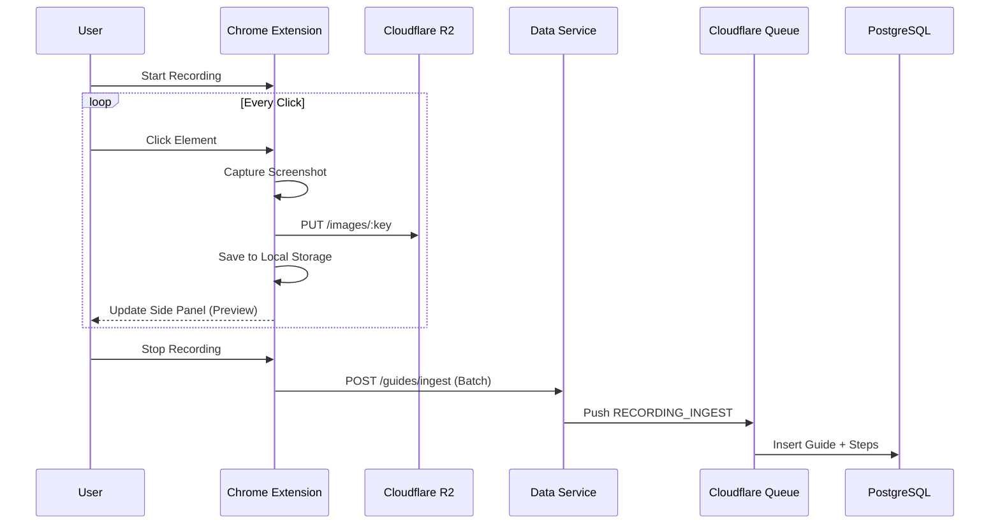

# Recording Workflow Architecture (Batch Strategy)

## Overview
This workflow prioritizes user experience and data integrity by using **Chrome Local Storage** as a temporary buffer and **R2** for immediate asset storage. The database is only updated once the recording is complete, ensuring a clean "commit" of the entire guide.

## Workflow Steps

### 1. Initialization
- **User Action**: Clicks "Start Recording".
- **Extension**:
  - Generates `recordingId` (UUID).
  - Sets state `isRecording: true` in `chrome.storage.local`.
  - Clears previous steps.

### 2. Step Capture (Per Click)
- **User Action**: Clicks on an element.
- **Extension (Content Script)**:
  - Intercepts click, sends selector/metadata to Background.
- **Extension (Background)**:
  - **Capture**: Takes screenshot.
  - **Upload (Immediate)**:
    - Uploads image to R2 via Data Service (`PUT /images/:key`).
    - *Why?* To secure the asset and get a valid URL for the preview.
  - **Store (Local)**:
    - Creates step object with `selector`, `url`, `timestamp`, and **`imageKey`**.
    - Saves to `chrome.storage.local`.
- **Extension (Side Panel)**:
  - Listens to storage changes.
  - Renders the new step immediately using the image from R2 (or local preview).

### 3. Finalization (Batch Ingest)
- **User Action**: Clicks "Stop Recording".
- **Extension**:
  - Reads all steps from `chrome.storage.local`.
  - Sends **Batch Payload** to Data Service (`POST /guides/ingest`).
    - Payload: `{ guide: { ... }, steps: [ ... ] }`
- **Data Service**:
  - Validates payload.
  - Pushes **One Message** (containing the entire guide + steps) to Cloudflare Queue.
- **Queue Consumer**:
  - Receives the batch.
  - Transactionally inserts:
    1. `Guide` record.
    2. All `Step` records.
- **Web App**:
  - User is redirected to the editor.
  - The guide loads instantly from the DB.

## Infrastructure & Decisions

### Why Local Storage?
- **Reliability**: If the internet cuts out, steps are saved locally.
- **Performance**: No DB writes per click.
- **Simplicity**: No need for complex "draft" states in the DB.

### Why No KV?
- **Redundant**: `chrome.storage.local` acts as the "KV" for the active session.
- **Cost/Complexity**: Adding KV adds an extra network hop and cost without solving a problem that Local Storage doesn't already solve.

### R2 Images
- Images are uploaded *immediately* to ensure they are safe and to allow the extension to display them using the R2 URL (via the Data Service proxy).

## Data Flow Diagram

