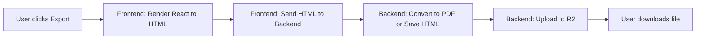

# Export Architecture - Simple Explanation

## The Goal

When a user clicks "Export PDF" or "Export HTML", we want to create a beautiful document that looks **exactly** like the guide page they see in the browser.

---

## The Solution (Simple Version)

**Use React's built-in `renderToStaticMarkup()` to convert your React component to HTML, then send it to the backend.**



---

## Step-by-Step Flow

### 1. User Clicks Export Button

User is viewing their guide and clicks "Export PDF" in the export dialog.

### 2. Frontend Fetches Guide Data

```typescript
// In export-dialog.tsx
const guide = await trpcClient.guides.getById.query({ id: guideId });
```

### 3. Frontend Renders React Component to HTML String

This is the magic part - we take your existing React UI and turn it into pure HTML:

```typescript
import { renderToStaticMarkup } from 'react-dom/server';

// Render the React component to an HTML string
const htmlString = renderToStaticMarkup(
    <GuideExportTemplate 
        guide={guide}
        assetsUrl="https://assets.stepps.ai"
    />
);

// htmlString now contains something like:
// "<html><head><style>...</style></head><body><h1>My Guide</h1>...</body></html>"
```

### 4. Frontend Sends HTML to Backend

```typescript
await exportMutation.mutateAsync({
    guideId: guide.id,
    format: 'pdf', // or 'html'
    htmlContent: htmlString, // The rendered HTML
});
```

### 5. Backend Receives HTML and Processes It

The backend doesn't need to know how to render your UI - it just receives ready-to-use HTML:

```typescript
// In data-service workflow
if (format === 'pdf') {
    // Send HTML to Cloudflare REST API to convert to PDF
    const pdfBytes = await convertHTMLtoPDF(htmlContent);
    // Upload to R2...
} else {
    // Just save the HTML directly
    await uploadToR2(htmlContent, 'text/html');
}
```

---

## The Component: GuideExportTemplate

Create a new component that's a **print-optimized version** of your existing `$guideId.tsx`:

```typescript
// user-application/src/components/guide-export-template.tsx

export function GuideExportTemplate({ 
    guide, 
    assetsUrl 
}: { 
    guide: Guide; 
    assetsUrl: string;
}) {
    const steps = (guide.steps ?? []) as Step[];
    
    return (
        <html lang="en">
            <head>
                <meta charSet="UTF-8" />
                <title>{guide.title}</title>
                <style>{`
                    /* Inline all the styles here */
                    body {
                        font-family: -apple-system, BlinkMacSystemFont, "Segoe UI", Roboto, sans-serif;
                        max-width: 768px;
                        margin: 0 auto;
                        padding: 48px 24px;
                    }
                    
                    h1 {
                        font-size: 3rem;
                        font-weight: 700;
                        text-align: center;
                        margin-bottom: 48px;
                    }
                    
                    .step {
                        margin-bottom: 80px;
                    }
                    
                    .step-header {
                        display: flex;
                        gap: 16px;
                        margin-bottom: 24px;
                    }
                    
                    .step-number {
                        width: 32px;
                        height: 32px;
                        border-radius: 50%;
                        background: rgba(0, 0, 0, 0.1);
                        display: flex;
                        align-items: center;
                        justify-content: center;
                        font-weight: 700;
                    }
                    
                    .screenshot {
                        border-radius: 12px;
                        border: 1px solid #e5e7eb;
                        overflow: hidden;
                    }
                    
                    img {
                        width: 100%;
                        display: block;
                    }
                    
                    /* ...more styles copied from your Tailwind classes... */
                `}</style>
            </head>
            <body>
                <h1>{guide.title}</h1>
                
                {steps.map((step, index) => (
                    <div key={step.id} className="step">
                        <div className="step-header">
                            <div className="step-number">{index + 1}</div>
                            <h2>{step.caption || step.aiCaption}</h2>
                        </div>
                        
                        {step.imageKey && (
                            <div className="screenshot">
                                
                            </div>
                        )}
                    </div>
                ))}
            </body>
        </html>
    );
}
```

---

## Why This is Simple & Good

### ✅ Guaranteed to Look Perfect

The HTML is generated from the **same React component** you use in the browser. If it looks good in the browser, it will look good in the PDF.

### ✅ No Manual CSS Conversion

You just copy-paste your styles into a `<style>` tag. No need to manually convert Tailwind classes.

### ✅ Single Source of Truth

Update the `GuideExportTemplate` component → exports automatically update.

### ✅ Backend Stays Simple

Backend just receives HTML and sends it to Cloudflare. No rendering logic needed on the backend.

---

## What About Overlays?

The overlays (circles, arrows) are rendered as SVG in the HTML:

```typescript
{step.overlays?.map(overlay => {
    if (overlay.type === 'circle') {
        return (
            <svg 
                key={overlay.id}
                style={{
                    position: 'absolute',
                    top: 0,
                    left: 0,
                    width: '100%',
                    height: '100%',
                }}
            >
                <circle
                    cx={`${overlay.x}%`}
                    cy={`${overlay.y}%`}
                    r={overlay.radius}
                    fill="none"
                    stroke={overlay.color}
                    strokeWidth={overlay.strokeWidth}
                />
            </svg>
        );
    }
})}
```

---

## Performance Concerns?

**Q: Is `renderToStaticMarkup()` heavy?**

**A: No, it's fast!** Rendering a guide with 10-20 steps takes ~10-50ms. It's a synchronous operation that happens in milliseconds.

**Q: Should frontend do this work?**

**A: Yes, it's fine!** The frontend is already rendering the component in the browser. `renderToStaticMarkup()` does the exact same thing but outputs HTML instead of DOM nodes. It's not a "heavy task" - it's just string generation.

---

## Code Changes Summary

### Files to Create

1. **`user-application/src/components/guide-export-template.tsx`**
   - Print-optimized React component
   - Looks like `$guideId.tsx` but with inline styles

### Files to Modify

2. **`user-application/src/components/export-dialog.tsx`**
   - Add `renderToStaticMarkup()` call
   - Send HTML to backend

3. **`user-application/worker/trpc/routers/exports.ts`**
   - Accept `htmlContent` in input schema
   - Pass HTML to backend service

4. **`data-service/src/index.ts`**
   - Add RPC method that receives `htmlContent`

5. **`data-service/src/helpers/browser-render.ts`**
   - Update to use REST API instead of Puppeteer
   - Accept HTML string as input

6. **`data-service/src/workflows/guide-pdf-export.ts`**
   - Receive HTML from frontend
   - Convert to PDF or save as HTML

---

## The Complete Flow (Visual)

```
┌─────────────────────────────────────────────────────────────┐
│ FRONTEND                                                     │
├─────────────────────────────────────────────────────────────┤
│                                                              │
│  1. User clicks "Export PDF"                                │
│                                                              │
│  2. Fetch guide data                                        │
│     const guide = await trpc.guides.getById.query(...)      │
│                                                              │
│  3. Render React component to HTML                          │
│     const html = renderToStaticMarkup(                      │
│         <GuideExportTemplate guide={guide} />               │
│     )                                                        │
│     // html = "<html><body>...</body></html>"              │
│                                                              │
│  4. Send HTML to backend                                    │
│     await trpc.exports.triggerExport.mutate({               │
│         guideId,                                            │
│         format: 'pdf',                                      │
│         htmlContent: html  ← The rendered HTML string       │
│     })                                                       │
│                                                              │
└─────────────────────────────────────────────────────────────┘
                            ↓
┌─────────────────────────────────────────────────────────────┐
│ USER-APPLICATION WORKER                                      │
├─────────────────────────────────────────────────────────────┤
│                                                              │
│  5. Receive TRPC request                                    │
│     { guideId, format: 'pdf', htmlContent: "..." }          │
│                                                              │
│  6. Call backend service via RPC                            │
│     await env.BACKEND_SERVICE.triggerExport({               │
│         guideId,                                            │
│         accountId: getUserAccountId(),                      │
│         format: 'pdf',                                      │
│         htmlContent: htmlContent  ← Pass through            │
│     })                                                       │
│                                                              │
└─────────────────────────────────────────────────────────────┘
                            ↓
┌─────────────────────────────────────────────────────────────┐
│ DATA-SERVICE (Backend)                                       │
├─────────────────────────────────────────────────────────────┤
│                                                              │
│  7. Trigger workflow with HTML                              │
│     await env.GUIDE_EXPORT_WORKFLOW.create({                │
│         params: {                                           │
│             guideId,                                        │
│             accountId,                                      │
│             format: 'pdf',                                  │
│             htmlContent: "..."  ← The HTML from frontend    │
│         }                                                    │
│     })                                                       │
│                                                              │
│  8. Workflow converts HTML to PDF                           │
│     const response = await fetch(                           │
│         'https://api.cloudflare.com/.../pdf',               │
│         {                                                    │
│             method: 'POST',                                 │
│             body: JSON.stringify({                          │
│                 html: htmlContent  ← Send the HTML          │
│             })                                              │
│         }                                                    │
│     )                                                        │
│     const pdfBytes = await response.arrayBuffer()           │
│                                                              │
│  9. Upload PDF to R2                                        │
│     await env.BUCKET.put(                                   │
│         `exports/${accountId}/${guideId}.pdf`,              │
│         pdfBytes                                            │
│     )                                                        │
│                                                              │
│  10. Return download URL to user                            │
│                                                              │
└─────────────────────────────────────────────────────────────┘
```

---

## Summary

**Frontend does the rendering** (because it knows how), **backend does the heavy lifting** (PDF conversion, R2 upload).

This is clean, simple, and guarantees your exports look perfect! 🎉
